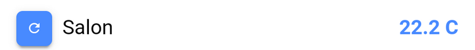
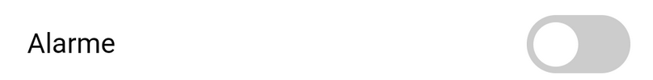
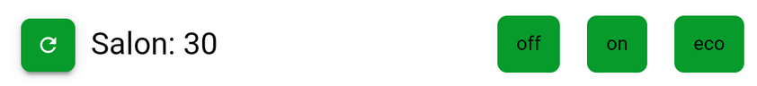
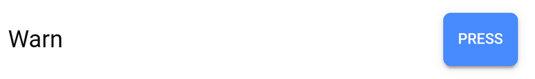
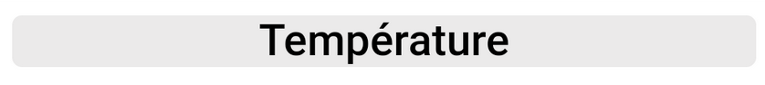
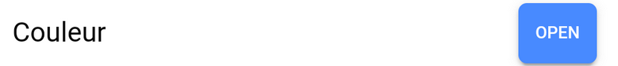
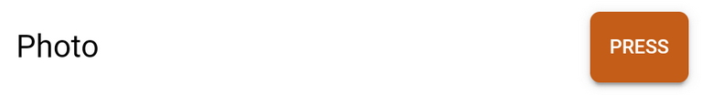

# HomeControl Guide

Ce document vous permettra de configurer plus facilement votre application mobile **[HomeControl](https://play.google.com/store/apps/details?id=fr.touin.thierry.homecontrol&hl=fr)** (Google Playstore).

## Configuration backoffice
Vous devez aller sur les pages de configuration en cliquant sur le bouton 

Vous arrivez sur une page avec 4 onglets:

1. L'onglet **Jeedom** vous permettra de configurer l'accès à votre box Jeedom

Le lien vers votre box peux ressembler a ça
```
 http://#IP_JEEDOM#/core/api/jeeApi.php?apikey=#APIKEY
```
Cette page est partagée en 4 zones. En réalité, elle vous permet de renseigner le lien vers votre box Jeedom.
- Le **Protocol** est **http** ou **https** suivant votre installation.
- Le **Domain** correspond à l'adresse IP ou le nom de domaine de votre box.
- Le **Port** est en général 80 (http) ou 443 (https). Dans tous les cas, vous devez renseigner la valeur.
- La **Clé Jeedom** est la clé d'API de votre box. Vous devez la récuperer via l'interface Web de cette dernière. 


2. L'onglet **Pages** vous permettra de nommer les onglets principaux. 
*Attention* : un redémarrage de l'application est nécessaire pour prise en compte.

​     Dans cet onglet, vous pourrez aussi changer le thème par défaut. Je suis preneur de nouvelles couleur :-)


2. L'onglet **IMP/EXP** vous permettra d'importer et d'exporter la configuration. Par exemple si vous changez de téléphone. 
    La sauvegarde **HomeControlConfig.json** est localisée dans le répertoire **[sdcard]/HomeControl** de votre téléphone. Elle est au format **json**. 
3. L'onglet **Debug** vous permet d'activer un mode facilitant l'analyse si vous détectez un problème dans l'application. Cet onglet est réservé au expert.


## Configuration des widgets

Le bouton  , vous permet d'ajouter des widgets sur les 4 pages principales.

Les type de widgets sont les suivants:

1. **Une simple information**

Ce widget vous permet d'afficher la valeur d'un capteur comme une température.

Vous pourrez spécifier 

- un identifiant d'action Jeedom, 
- un libellé
- l'unité si besoin



2. **Un bouton avec 2 actions**

Ce widget vous permet d'afficher un bouton **toogle** avec son libellé. Il vous sera demander de renseigner les valeurs suivantes:

- un identifiant Jeedom permettant de positionner le bouton sur on ou off.
- un identifiant Jeedom de l'action a faire sur Off
- un identifiant Jeedom de l'action a faire sur On
- une valeur charnière permettant de switcher entre le On et le Off (à voir si c'est util :-) ).
- un libellé
- l'unité ne sert à rien pour ce widget



3. **Un bouton avec 3 actions**

Ce widget vous permet d'afficher une ligne de 3 boutons avec son libellé. Il vous sera demandé de renseigner les valeurs suivantes:

- un identifiant Jeedom permettant de retourner une valeur.
- un identifiant Jeedom de l'action a faire sur la position 0
- un identifiant Jeedom de l'action a faire sur la position 1
- un identifiant Jeedom de l'action a faire sur la position 2
- un libellé

Dans mon cas, je l'utilise pour le chauffage dont la valeur pour aller de 0 à 99.

Si vous renseignez **-1** pour un identifiant, le bouton ne sera pas affiché. 



4. **Un bouton poussoir**

Ce widget vous permet d'exécuter une action. Il vous sera demandé de renseigner les valeurs suivantes:

- un identifiant Jeedom de l'action a faire 
- un libellé

J'utilise ce widget pour changer la couleur d'une ampoule connectée (warn light <=> cold light )



5. **Un variateur**

Ce widget vous permet de modifier l'intensité d'un élément. Il vous sera demandé de renseigner les valeurs suivantes:

- un identifiant Jeedom permettant de retourner la valeur courante.
- un identifiant Jeedom de l'action a faire pour passer la nouvelle valeur
- une valeur minimum possible
- une valeur maximum possible


Vous avez plusieurs styles possibles.

6. **Un libellé (titre simple)**

Ce widget vous permet d'afficher un libellé tout simple. Vous avez plusieurs styles possibles.



7. **Un bouton changer la couleur**

Ce widget vous permet de modifier la couleur d'une ampoule connectée. Il vous sera demandé de renseigner les valeurs suivantes:

- un identifiant Jeedom de l'action a faire pour passer la nouvelle valeur de la couleur
- un libellé



8. **Un bouton + url libre**

Ce widget vous permet d'exécuter une action sans passer par Jeedom. Il vous sera demandé de renseigner les valeurs suivantes:

- l'url de l'action à faire.
- un libellé



J'utilise ce widget pour prendre une photo de mon salon avec un accès direct à ma caméra.


## Modification des widgets


> Pour modifier un widget, il faut faire un appui long directement sur le widget. Vous retrouvez ainsi le formulaire qui vous a permis d'ajouter le widget.


