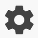
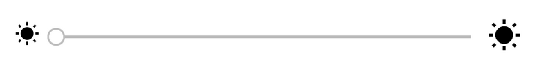

 Ce document vous permettra de configurer plus facilement votre application mobile **[HomeControl](https://play.google.com/store/apps/details?id=fr.touin.thierry.homecontrol&hl=fr)** (Google Playstore).

## Configuration backoffice
Vous devez aller sur les pages de configuration en cliquant sur le bouton 

Vous arrivez sur une page avec 4 onglets:

1. L'onglet **Jeedom** vous permettra de configurer l'accès à votre box Jeedom

Le lien vers votre box peux ressembler a ça
```
 http://#IP_JEEDOM#/core/api/jeeApi.php?apikey=#APIKEY
```
Cette page est partagée en 4 zones. En réalité, elle vous permet de renseigner le lien vers votre box Jeedom.
- Le **Protocol** est **http** ou **https** suivant votre installation.
- Le **Domain** correspond à l'adresse IP ou le nom de domaine de votre box.
- Le **Port** est en général 80 (http) ou 443 (https). Dans tous les cas, vous devez renseigner la valeur.
- La **Clé Jeedom** est la clé d'API de votre box. Vous devez la récuperer via l'interface Web de cette dernière. 


2. L'onglet **Pages** vous permettra de nommer les onglets principaux. 
*Attention* : un redémarrage de l'application est nécessaire pour prise en compte.

​     Dans cet onglet, vous pourrez aussi changer le thème par défaut. Je suis preneur de nouvelles couleur :-)


2. L'onglet **IMP/EXP** vous permettra d'importer et d'exporter la configuration. Par exemple si vous changez de téléphone. 
    La sauvegarde **HomeControlConfig.json** est localisée dans le répertoire **[sdcard]/HomeControl** de votre téléphone. Elle est au format **json**. 
3. L'onglet **Debug** vous permet d'activer un mode facilitant l'analyse si vous détectez un problème dans l'application. Cet onglet est réservé au expert.


## Configuration des widgets

Le bouton  , vous permet d'ajouter des widgets sur les 4 pages principales.

Les type de widgets sont les suivants:

1. Une simple information


2. Un bouton avec 2 actions


2. Un bouton avec 3 actions


3. Un bouton poussoir


4. Un variateur




5. Un libellé (titre simple)


6. Un bouton changer la couleur


7. Un bouton + url libre


> Pour modifier un widget, il faut faire un appui long sur le widget.

